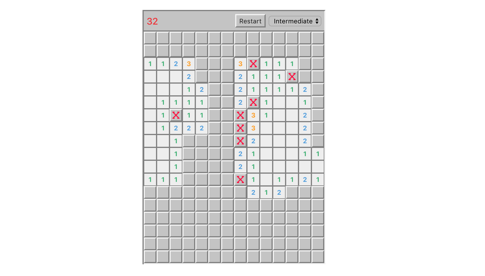

# Welcome to Minesweeper!

## To get minesweepin'

For the very first time, run `npm` or `yarn install` to install dependencies.
Then run `npm start` or `yarn start` to run the game. 
Head over to [http://localhost:3000](http://localhost:3000) to enjoy!

## Instructions

* The number on the top left corner of the game is the number of bombs left minus the flags used.

* Right click to flag a cell

* Double click on a cell to open all surrounding cells of a center cell

However, it will open up only when the number of flagged cells and the number indicated in the center cell matches.
